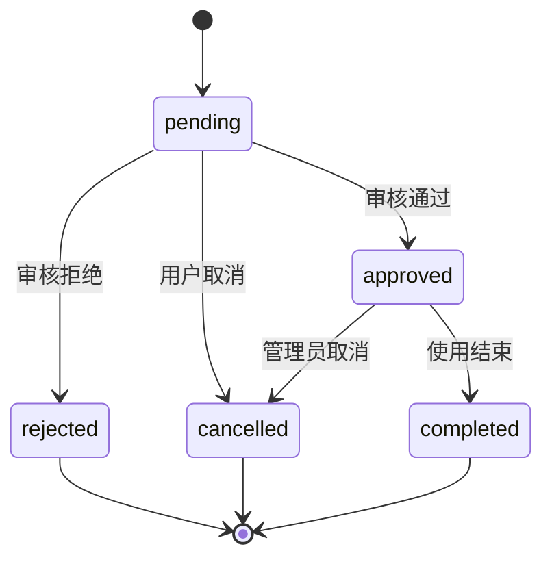
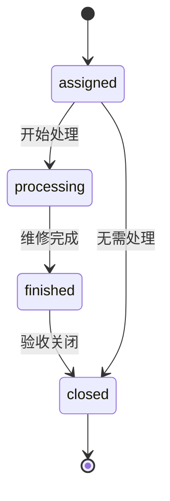

# LabOps 业务流程设计

## v1.3 增量说明

当前业务流程按三类演示身份展开：

1. 普通用户提交预约或报修，只能查看和取消本人预约、查看本人报修。
2. 设备负责人处理本人负责设备相关流程，包括设备状态维护、预约审批、报修查看和维修工单推进。
3. 管理员拥有全局业务后台，可以处理所有设备、预约、报修和工单。

预约审核不再只描述为教师或管理员审核；v1.3 中设备负责人也可以在本人负责设备范围内审批预约。报修到工单流程也不再只由管理员处理；设备负责人可以为本人负责设备的报修创建和推进工单。

## 1. 流程设计概述

LabOps 的业务流程围绕设备生命周期展开。设备从录入系统开始，被用户查询和预约；设备使用过程中可能发生故障；故障进入报修和维修工单流程；最终预约记录、报修记录和维修结果沉淀为数据分析指标。

核心流程包括：

- 设备建档流程。
- 设备预约流程。
- 预约审核流程。
- 设备报修流程。
- 维修工单流程。
- 数据看板统计流程。

## 2. 设备建档流程

### 2.1 参与角色

- 实验室管理员。
- 系统管理员。

### 2.2 流程步骤

1. 管理员进入设备台账页面。
2. 管理员选择所属实验室和设备分类。
3. 管理员填写设备编号、名称、负责人、购置日期、描述等信息。
4. 系统校验设备编号是否重复。
5. 系统保存设备信息，默认状态为 `idle`。
6. 设备出现在设备列表和首页看板统计中。

### 2.3 业务规则

- 设备编号必须唯一。
- 停用设备不可预约。
- 故障设备不可预约。
- 维护中设备不可预约。
- 设备删除建议使用逻辑删除或停用，避免影响历史预约和维修记录。

## 3. 设备预约流程

### 3.1 参与角色

- 学生。
- 教师。
- 实验室管理员。

### 3.2 主流程

1. 用户登录系统。
2. 用户进入设备列表。
3. 用户按实验室、分类、状态筛选设备。
4. 用户进入设备详情页，查看设备状态和已有预约。
5. 用户选择预约开始时间、结束时间和使用目的。
6. 系统检查设备状态和时间冲突。
7. 系统创建预约记录，状态为 `pending`。
8. 教师或实验室管理员审核预约。
9. 审核通过后，预约状态变为 `approved`。
10. 到达预约结束时间后，系统或管理员将预约标记为 `completed`。

### 3.3 异常流程

| 场景 | 处理方式 |
| --- | --- |
| 时间段冲突 | 系统拒绝提交，并提示用户选择其他时间 |
| 设备故障或维护中 | 系统不允许预约 |
| 审核不通过 | 审核人填写拒绝原因，状态变为 `rejected` |
| 用户主动取消 | 未开始的预约可取消，状态变为 `cancelled` |
| 管理员强制取消 | 管理员可因设备故障或实验室安排取消预约 |

### 3.4 状态流转

## 4. 预约审核流程

### 4.1 审核入口

教师和实验室管理员可在预约审核页面查看待审核记录。列表应突出展示预约设备、申请人、预约时间、使用目的和冲突风险。

### 4.2 审核规则

- 审核人不能审核不存在的预约。
- 已取消、已拒绝、已完成的预约不能重复审核。
- 审核通过前需要再次检查时间冲突。
- 审核拒绝必须填写拒绝原因。

### 4.3 审核结果

- 通过：预约生效，占用对应设备时间段。
- 拒绝：预约不生效，用户可重新提交。

## 5. 设备报修流程

### 5.1 参与角色

- 学生。
- 教师。
- 实验室管理员。

### 5.2 主流程

1. 用户在设备详情页或报修页面选择故障设备。
2. 用户填写故障类型、故障描述和紧急程度。
3. 系统生成报修记录，状态为 `submitted`。
4. 实验室管理员查看报修记录。
5. 管理员受理报修，状态变为 `accepted`。
6. 管理员根据情况创建维修工单。
7. 报修记录进入已派单或处理中状态。

### 5.3 业务规则

- 报修记录必须关联具体设备。
- 如果设备存在严重故障，管理员可将设备状态改为 `fault`。
- 同一设备可以存在多条报修记录，但不建议重复创建相同未关闭故障。
- 报修关闭后不可继续编辑核心故障信息。

## 6. 维修工单流程

### 6.1 参与角色

- 实验室管理员。
- 维修负责人，复试版可由实验室管理员兼任。

### 6.2 主流程

1. 管理员基于报修记录创建工单。
2. 管理员设置优先级、处理人和计划处理时间。
3. 工单状态为 `assigned`。
4. 处理人开始处理，状态变为 `processing`。
5. 处理人填写维修过程和维修结果。
6. 工单完成，状态变为 `finished`。
7. 管理员验收后关闭工单，状态变为 `closed`。
8. 系统生成维护记录，并更新设备状态。

### 6.3 工单状态流转

### 6.4 工单优先级

| 优先级 | 说明 |
| --- | --- |
| low | 不影响当前教学实验，可排期处理 |
| medium | 影响部分使用，需要尽快处理 |
| high | 影响重要实验或多人预约，需要优先处理 |
| urgent | 设备存在安全风险，需要立即处理 |

## 7. 数据看板统计流程

### 7.1 数据来源

首页看板和数据分析模块主要来自以下表：

- 设备表。
- 预约表。
- 报修表。
- 工单表。
- 维护记录表。
- 实验室表。

### 7.2 统计指标

| 指标 | 计算方式 |
| --- | --- |
| 设备总数 | 设备表记录数 |
| 在线设备数 | 状态不为停用的设备数 |
| 今日预约数 | 今日开始或创建的预约数 |
| 待审核预约数 | 状态为 `pending` 的预约数 |
| 待处理报修数 | 未关闭的报修数 |
| 设备利用率 | 预约占用时长 / 设备可用总时长 |
| 平均维修时长 | 工单完成时间与创建时间的平均差值 |
| 故障率 | 故障设备数 / 设备总数 |

### 7.3 展示流程

1. 前端进入首页。
2. 前端请求 `/api/v1/dashboard/summary` 获取指标卡片数据。
3. 前端请求趋势和分布类接口。
4. 后端从业务表聚合数据。
5. 前端使用 ECharts 渲染图表。
6. 用户通过看板判断实验室运行状态。

## 8. 复试演示主线

建议复试现场按以下顺序演示：

1. 打开首页看板，说明系统整体定位和运行指标。
2. 进入设备管理，展示设备台账和设备状态。
3. 以学生身份提交一个设备预约。
4. 以教师或管理员身份审核预约。
5. 模拟设备故障，提交一条报修记录。
6. 创建维修工单并完成处理。
7. 回到数据分析页面，说明预约和运维数据如何沉淀为管理指标。

这条主线能完整覆盖“预约、设备、报修、工单、数据分析”五个核心模块。

## 9. 答辩时可强调的流程亮点

- 预约不是简单新增记录，而是包含设备状态校验、时间冲突校验和审批状态流转。
- 报修不是简单反馈问题，而是与工单关联，形成受理、处理、完成、关闭的闭环。
- 看板不是静态页面，而是从设备、预约、报修、工单等业务数据聚合而来。
- 业务流程和权限模型互相配合，例如学生提交、教师审核、管理员运维、系统管理员配置。
