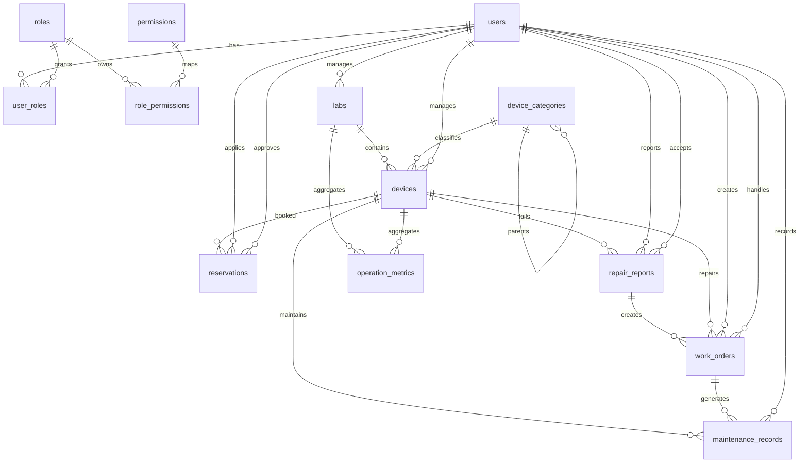

# LabOps 数据库设计

## v1.3 增量说明

当前实现中的主演示角色和账号为：

| 用户名 | 角色编码 | 说明 |
| --- | --- | --- |
| `ordinary01` | `ordinary_user` | 普通用户，自助预约和报修 |
| `owner01` | `device_owner` | 设备负责人，处理本人负责设备相关预约、报修和工单 |
| `labadmin01` | `lab_admin` | 实验室管理员，全局业务运营 |
| `admin` | `system_admin` | 系统管理员，全局管理和系统设置 |

设备负责人数据范围由 `devices.manager_id` 支撑。后端查询设备、预约、报修和工单时，会根据当前用户角色追加设备负责人范围过滤：

- 设备列表：`devices.manager_id = current_user.id`
- 预约列表：通过 `reservations.device_id -> devices.id` 关联后过滤 `devices.manager_id`
- 报修列表：通过 `repair_reports.device_id -> devices.id` 关联后过滤 `devices.manager_id`
- 工单列表：通过 `work_orders.device_id -> devices.id` 关联后过滤 `devices.manager_id`

设备负责人可以维护本人负责设备状态，但不能通过设备更新接口修改 `manager_id`。

## 1. 设计目标

LabOps 使用 PostgreSQL 存储实验室设备预约、报修、维修工单和运营看板数据。数据库设计围绕三条主线展开：

1. 设备资源主线：实验室、设备分类、设备台账、设备状态。
2. 业务流程主线：预约申请、预约审核、报修提交、工单派发、维护记录归档。
3. 权限与分析主线：用户、角色、权限、运营指标快照。

本设计优先保证数据关系清晰、状态流转可追踪、演示数据容易初始化，同时保留后续扩展空间。后端实现时建议使用 SQLAlchemy ORM + Alembic 管理迁移。

## 2. PostgreSQL 基础约定

### 2.1 命名约定

- 表名使用复数小写蛇形命名，例如 `users`、`repair_reports`。
- 主键统一使用 `id UUID PRIMARY KEY`。
- 外键字段使用 `<entity>_id` 命名，例如 `device_id`、`applicant_id`。
- 时间字段统一使用 `TIMESTAMPTZ`，便于跨时区部署和日志追踪。
- 状态字段使用 PostgreSQL `ENUM` 或 `VARCHAR + CHECK`。演示项目推荐先使用 `VARCHAR + CHECK`，迁移和调整更轻量；如果后续状态稳定，可以迁移为 `ENUM`。

### 2.2 推荐扩展

```sql
CREATE EXTENSION IF NOT EXISTS pgcrypto;
CREATE EXTENSION IF NOT EXISTS btree_gist;
```

- `pgcrypto` 用于 `gen_random_uuid()` 生成 UUID。
- `btree_gist` 用于设备预约时间段排他约束，防止同一设备出现重叠预约。

### 2.3 通用字段

除关联表和指标快照外，核心业务表建议保留以下通用字段：

| 字段 | 类型 | 约束 | 说明 |
| --- | --- | --- | --- |
| id | UUID | PK, default `gen_random_uuid()` | 主键 |
| created_at | TIMESTAMPTZ | NOT NULL, default `now()` | 创建时间 |
| updated_at | TIMESTAMPTZ | NOT NULL, default `now()` | 更新时间 |

`updated_at` 可由应用层统一维护，也可后续增加数据库 trigger。

## 3. 枚举状态设计

### 3.1 用户状态

| 状态 | 说明 |
| --- | --- |
| active | 正常可登录 |
| disabled | 停用 |
| locked | 锁定 |

### 3.2 设备状态

| 状态 | 说明 | 是否可预约 |
| --- | --- | --- |
| idle | 空闲 | 是 |
| in_use | 使用中 | 否 |
| maintenance | 维护中 | 否 |
| fault | 故障 | 否 |
| disabled | 停用 | 否 |

### 3.3 预约状态

| 状态 | 说明 |
| --- | --- |
| pending | 待审核 |
| approved | 已通过 |
| rejected | 已拒绝 |
| cancelled | 已取消 |
| completed | 已完成 |

### 3.4 报修状态

| 状态 | 说明 |
| --- | --- |
| submitted | 已提交 |
| accepted | 已受理 |
| assigned | 已派单 |
| processing | 处理中 |
| finished | 已完成 |
| closed | 已关闭 |

### 3.5 工单状态

| 状态 | 说明 |
| --- | --- |
| assigned | 已派单 |
| processing | 处理中 |
| finished | 已完成 |
| closed | 已关闭 |

### 3.6 工单优先级

| 优先级 | 说明 |
| --- | --- |
| low | 低 |
| medium | 中 |
| high | 高 |
| urgent | 紧急 |

### 3.7 维护类型

| 类型 | 说明 |
| --- | --- |
| routine | 定期保养 |
| repair | 故障维修 |
| calibration | 校准检测 |
| replacement | 备件更换 |
| enable | 启用 |
| disable | 停用 |

### 3.8 指标周期

| 周期 | 说明 |
| --- | --- |
| daily | 日 |
| weekly | 周 |
| monthly | 月 |

## 4. 表结构设计

### 4.1 users 用户表

用于保存系统登录账号和人员基础信息。

| 字段 | 类型 | 约束 | 说明 |
| --- | --- | --- | --- |
| id | UUID | PK | 用户 ID |
| username | VARCHAR(64) | NOT NULL, UNIQUE | 登录名 |
| password_hash | VARCHAR(255) | NOT NULL | 密码哈希 |
| real_name | VARCHAR(64) | NOT NULL | 真实姓名 |
| email | VARCHAR(128) | UNIQUE | 邮箱 |
| phone | VARCHAR(32) |  | 手机号 |
| department | VARCHAR(128) |  | 院系或部门 |
| student_no | VARCHAR(64) | UNIQUE | 学号，学生可填 |
| employee_no | VARCHAR(64) | UNIQUE | 工号，教师或管理员可填 |
| status | VARCHAR(32) | NOT NULL, default `active` | 用户状态 |
| last_login_at | TIMESTAMPTZ |  | 最近登录时间 |
| created_at | TIMESTAMPTZ | NOT NULL | 创建时间 |
| updated_at | TIMESTAMPTZ | NOT NULL | 更新时间 |

约束建议：

- `status IN ('active','disabled','locked')`
- `username` 不区分大小写唯一时，可建立 `UNIQUE INDEX uk_users_lower_username ON users (lower(username));`
- `email` 不区分大小写唯一时，可建立 `UNIQUE INDEX uk_users_lower_email ON users (lower(email)) WHERE email IS NOT NULL;`

索引建议：

- `idx_users_status(status)`
- `idx_users_real_name(real_name)`

### 4.2 roles 角色表

用于 RBAC 角色定义。

| 字段 | 类型 | 约束 | 说明 |
| --- | --- | --- | --- |
| id | UUID | PK | 角色 ID |
| code | VARCHAR(64) | NOT NULL, UNIQUE | 角色编码 |
| name | VARCHAR(64) | NOT NULL | 角色名称 |
| description | TEXT |  | 角色说明 |
| is_system | BOOLEAN | NOT NULL, default `false` | 是否系统内置角色 |
| created_at | TIMESTAMPTZ | NOT NULL | 创建时间 |
| updated_at | TIMESTAMPTZ | NOT NULL | 更新时间 |

初始化角色：

- `student`
- `teacher`
- `lab_admin`
- `system_admin`

索引建议：

- `uk_roles_code(code)`

### 4.3 permissions 权限表

用于菜单、按钮和接口权限控制。

| 字段 | 类型 | 约束 | 说明 |
| --- | --- | --- | --- |
| id | UUID | PK | 权限 ID |
| code | VARCHAR(128) | NOT NULL, UNIQUE | 权限编码，例如 `device:create` |
| name | VARCHAR(64) | NOT NULL | 权限名称 |
| resource | VARCHAR(64) | NOT NULL | 资源类型 |
| action | VARCHAR(64) | NOT NULL | 操作类型 |
| description | TEXT |  | 权限说明 |
| created_at | TIMESTAMPTZ | NOT NULL | 创建时间 |
| updated_at | TIMESTAMPTZ | NOT NULL | 更新时间 |

索引建议：

- `uk_permissions_code(code)`
- `idx_permissions_resource_action(resource, action)`

### 4.4 user_roles 用户角色关联表

| 字段 | 类型 | 约束 | 说明 |
| --- | --- | --- | --- |
| user_id | UUID | PK, FK -> `users.id` | 用户 ID |
| role_id | UUID | PK, FK -> `roles.id` | 角色 ID |
| created_at | TIMESTAMPTZ | NOT NULL | 授权时间 |

外键策略：

- 删除用户时级联删除授权：`ON DELETE CASCADE`
- 删除角色时级联删除授权：`ON DELETE CASCADE`

索引建议：

- 主键 `(user_id, role_id)`
- `idx_user_roles_role_id(role_id)`

### 4.5 role_permissions 角色权限关联表

| 字段 | 类型 | 约束 | 说明 |
| --- | --- | --- | --- |
| role_id | UUID | PK, FK -> `roles.id` | 角色 ID |
| permission_id | UUID | PK, FK -> `permissions.id` | 权限 ID |
| created_at | TIMESTAMPTZ | NOT NULL | 授权时间 |

外键策略：

- 删除角色时级联删除授权：`ON DELETE CASCADE`
- 删除权限时级联删除授权：`ON DELETE CASCADE`

索引建议：

- 主键 `(role_id, permission_id)`
- `idx_role_permissions_permission_id(permission_id)`

### 4.6 labs 实验室表

用于管理实验室空间和负责人。

| 字段 | 类型 | 约束 | 说明 |
| --- | --- | --- | --- |
| id | UUID | PK | 实验室 ID |
| code | VARCHAR(64) | NOT NULL, UNIQUE | 实验室编号 |
| name | VARCHAR(128) | NOT NULL | 实验室名称 |
| location | VARCHAR(255) | NOT NULL | 位置 |
| manager_id | UUID | FK -> `users.id` | 实验室负责人 |
| contact_phone | VARCHAR(32) |  | 联系电话 |
| opening_hours | VARCHAR(128) |  | 开放时间说明 |
| description | TEXT |  | 实验室说明 |
| is_active | BOOLEAN | NOT NULL, default `true` | 是否启用 |
| created_at | TIMESTAMPTZ | NOT NULL | 创建时间 |
| updated_at | TIMESTAMPTZ | NOT NULL | 更新时间 |

外键策略：

- `manager_id` 对应用户删除时置空：`ON DELETE SET NULL`

索引建议：

- `uk_labs_code(code)`
- `idx_labs_manager_id(manager_id)`
- `idx_labs_is_active(is_active)`

### 4.7 device_categories 设备分类表

用于管理设备分类，可支持父子分类。

| 字段 | 类型 | 约束 | 说明 |
| --- | --- | --- | --- |
| id | UUID | PK | 分类 ID |
| parent_id | UUID | FK -> `device_categories.id` | 父分类 ID |
| code | VARCHAR(64) | NOT NULL, UNIQUE | 分类编码 |
| name | VARCHAR(128) | NOT NULL | 分类名称 |
| description | TEXT |  | 分类说明 |
| sort_order | INTEGER | NOT NULL, default `0` | 排序 |
| is_active | BOOLEAN | NOT NULL, default `true` | 是否启用 |
| created_at | TIMESTAMPTZ | NOT NULL | 创建时间 |
| updated_at | TIMESTAMPTZ | NOT NULL | 更新时间 |

外键策略：

- `parent_id` 删除时置空：`ON DELETE SET NULL`

索引建议：

- `uk_device_categories_code(code)`
- `idx_device_categories_parent_id(parent_id)`
- `idx_device_categories_is_active(is_active)`

### 4.8 devices 设备表

设备台账是预约、报修和运营分析的核心主表。

| 字段 | 类型 | 约束 | 说明 |
| --- | --- | --- | --- |
| id | UUID | PK | 设备 ID |
| code | VARCHAR(64) | NOT NULL, UNIQUE | 设备编号 |
| name | VARCHAR(128) | NOT NULL | 设备名称 |
| category_id | UUID | NOT NULL, FK -> `device_categories.id` | 设备分类 |
| lab_id | UUID | NOT NULL, FK -> `labs.id` | 所属实验室 |
| manager_id | UUID | FK -> `users.id` | 负责人 |
| status | VARCHAR(32) | NOT NULL, default `idle` | 设备状态 |
| health_score | NUMERIC(5,2) | NOT NULL, default `100.00` | 健康评分 |
| model | VARCHAR(128) |  | 规格型号 |
| manufacturer | VARCHAR(128) |  | 厂商 |
| serial_number | VARCHAR(128) | UNIQUE | 出厂序列号 |
| purchase_date | DATE |  | 购置日期 |
| purchase_price | NUMERIC(12,2) |  | 购置金额 |
| location_detail | VARCHAR(255) |  | 实验室内具体位置 |
| description | TEXT |  | 设备描述 |
| created_at | TIMESTAMPTZ | NOT NULL | 创建时间 |
| updated_at | TIMESTAMPTZ | NOT NULL | 更新时间 |

约束建议：

- `status IN ('idle','in_use','maintenance','fault','disabled')`
- `health_score >= 0 AND health_score <= 100`
- `purchase_price IS NULL OR purchase_price >= 0`

外键策略：

- 分类和实验室被引用后不建议物理删除：`ON DELETE RESTRICT`
- `manager_id` 对应用户删除时置空：`ON DELETE SET NULL`

索引建议：

- `uk_devices_code(code)`
- `idx_devices_category_id(category_id)`
- `idx_devices_lab_id(lab_id)`
- `idx_devices_manager_id(manager_id)`
- `idx_devices_status(status)`
- `idx_devices_lab_status(lab_id, status)`
- `idx_devices_category_status(category_id, status)`

### 4.9 reservations 预约表

记录用户对设备的预约申请、审核结果和实际完成状态。

| 字段 | 类型 | 约束 | 说明 |
| --- | --- | --- | --- |
| id | UUID | PK | 预约 ID |
| reservation_no | VARCHAR(64) | NOT NULL, UNIQUE | 预约编号 |
| device_id | UUID | NOT NULL, FK -> `devices.id` | 预约设备 |
| applicant_id | UUID | NOT NULL, FK -> `users.id` | 申请人 |
| approver_id | UUID | FK -> `users.id` | 审核人 |
| start_time | TIMESTAMPTZ | NOT NULL | 预约开始时间 |
| end_time | TIMESTAMPTZ | NOT NULL | 预约结束时间 |
| purpose | TEXT | NOT NULL | 使用目的 |
| participant_count | INTEGER | NOT NULL, default `1` | 参与人数 |
| status | VARCHAR(32) | NOT NULL, default `pending` | 预约状态 |
| reject_reason | TEXT |  | 拒绝原因 |
| cancel_reason | TEXT |  | 取消原因 |
| approved_at | TIMESTAMPTZ |  | 审核通过时间 |
| cancelled_at | TIMESTAMPTZ |  | 取消时间 |
| completed_at | TIMESTAMPTZ |  | 完成时间 |
| remark | TEXT |  | 备注 |
| created_at | TIMESTAMPTZ | NOT NULL | 创建时间 |
| updated_at | TIMESTAMPTZ | NOT NULL | 更新时间 |

约束建议：

- `status IN ('pending','approved','rejected','cancelled','completed')`
- `start_time < end_time`
- `participant_count > 0`
- `status = 'rejected'` 时 `reject_reason` 应由应用层强制填写。

预约冲突约束建议：

```sql
ALTER TABLE reservations
ADD CONSTRAINT ex_reservations_device_time
EXCLUDE USING gist (
  device_id WITH =,
  tstzrange(start_time, end_time, '[)') WITH &&
)
WHERE (status = 'approved');
```

该约束保证同一设备在已审核通过状态下不会出现重叠时间段。`pending` 预约允许暂存，但审核通过前需要再次检查冲突。

外键策略：

- `device_id`、`applicant_id` 被业务记录引用后不建议物理删除：`ON DELETE RESTRICT`
- `approver_id` 对应用户删除时置空：`ON DELETE SET NULL`

索引建议：

- `uk_reservations_reservation_no(reservation_no)`
- `idx_reservations_device_time(device_id, start_time, end_time)`
- `idx_reservations_applicant_id(applicant_id)`
- `idx_reservations_approver_id(approver_id)`
- `idx_reservations_status(status)`
- `idx_reservations_start_time(start_time)`
- `idx_reservations_device_status(device_id, status)`

### 4.10 repair_reports 报修记录表

记录用户提交的设备异常和报修处理状态。

| 字段 | 类型 | 约束 | 说明 |
| --- | --- | --- | --- |
| id | UUID | PK | 报修 ID |
| report_no | VARCHAR(64) | NOT NULL, UNIQUE | 报修编号 |
| device_id | UUID | NOT NULL, FK -> `devices.id` | 故障设备 |
| reporter_id | UUID | NOT NULL, FK -> `users.id` | 报修人 |
| accepted_by_id | UUID | FK -> `users.id` | 受理人 |
| fault_type | VARCHAR(64) | NOT NULL | 故障类型 |
| urgency | VARCHAR(32) | NOT NULL, default `medium` | 紧急程度 |
| description | TEXT | NOT NULL | 故障描述 |
| image_url | VARCHAR(512) |  | 故障图片地址 |
| status | VARCHAR(32) | NOT NULL, default `submitted` | 报修状态 |
| accepted_at | TIMESTAMPTZ |  | 受理时间 |
| closed_at | TIMESTAMPTZ |  | 关闭时间 |
| close_note | TEXT |  | 关闭说明 |
| created_at | TIMESTAMPTZ | NOT NULL | 创建时间 |
| updated_at | TIMESTAMPTZ | NOT NULL | 更新时间 |

约束建议：

- `status IN ('submitted','accepted','assigned','processing','finished','closed')`
- `urgency IN ('low','medium','high','urgent')`

外键策略：

- `device_id`、`reporter_id`：`ON DELETE RESTRICT`
- `accepted_by_id`：`ON DELETE SET NULL`

索引建议：

- `uk_repair_reports_report_no(report_no)`
- `idx_repair_reports_device_id(device_id)`
- `idx_repair_reports_reporter_id(reporter_id)`
- `idx_repair_reports_status(status)`
- `idx_repair_reports_fault_type(fault_type)`
- `idx_repair_reports_created_at(created_at)`
- `idx_repair_reports_device_status(device_id, status)`

### 4.11 work_orders 维修工单表

记录管理员基于报修创建的维修任务。

| 字段 | 类型 | 约束 | 说明 |
| --- | --- | --- | --- |
| id | UUID | PK | 工单 ID |
| work_order_no | VARCHAR(64) | NOT NULL, UNIQUE | 工单编号 |
| repair_report_id | UUID | NOT NULL, FK -> `repair_reports.id` | 关联报修 |
| device_id | UUID | NOT NULL, FK -> `devices.id` | 冗余设备 ID，便于查询 |
| creator_id | UUID | FK -> `users.id` | 创建人 |
| assignee_id | UUID | FK -> `users.id` | 处理人 |
| priority | VARCHAR(32) | NOT NULL, default `medium` | 优先级 |
| status | VARCHAR(32) | NOT NULL, default `assigned` | 工单状态 |
| planned_start_at | TIMESTAMPTZ |  | 计划开始时间 |
| planned_end_at | TIMESTAMPTZ |  | 计划结束时间 |
| started_at | TIMESTAMPTZ |  | 实际开始时间 |
| finished_at | TIMESTAMPTZ |  | 完成时间 |
| closed_at | TIMESTAMPTZ |  | 关闭时间 |
| process_note | TEXT |  | 处理过程 |
| result | TEXT |  | 维修结果 |
| cost_amount | NUMERIC(12,2) |  | 维修成本 |
| created_at | TIMESTAMPTZ | NOT NULL | 创建时间 |
| updated_at | TIMESTAMPTZ | NOT NULL | 更新时间 |

约束建议：

- `priority IN ('low','medium','high','urgent')`
- `status IN ('assigned','processing','finished','closed')`
- `planned_start_at IS NULL OR planned_end_at IS NULL OR planned_start_at < planned_end_at`
- `cost_amount IS NULL OR cost_amount >= 0`

外键策略：

- `repair_report_id`、`device_id`：`ON DELETE RESTRICT`
- `creator_id`、`assignee_id`：`ON DELETE SET NULL`

索引建议：

- `uk_work_orders_work_order_no(work_order_no)`
- `idx_work_orders_repair_report_id(repair_report_id)`
- `idx_work_orders_device_id(device_id)`
- `idx_work_orders_assignee_id(assignee_id)`
- `idx_work_orders_status(status)`
- `idx_work_orders_priority(priority)`
- `idx_work_orders_created_at(created_at)`
- `idx_work_orders_device_status(device_id, status)`

### 4.12 maintenance_records 维护记录表

用于沉淀设备生命周期事件。工单关闭后可自动生成一条 `repair` 类型维护记录。

| 字段 | 类型 | 约束 | 说明 |
| --- | --- | --- | --- |
| id | UUID | PK | 维护记录 ID |
| device_id | UUID | NOT NULL, FK -> `devices.id` | 设备 ID |
| work_order_id | UUID | FK -> `work_orders.id` | 来源工单 |
| maintainer_id | UUID | FK -> `users.id` | 维护人 |
| maintenance_type | VARCHAR(32) | NOT NULL | 维护类型 |
| title | VARCHAR(128) | NOT NULL | 维护标题 |
| content | TEXT | NOT NULL | 维护内容 |
| result | TEXT |  | 维护结果 |
| cost_amount | NUMERIC(12,2) |  | 维护成本 |
| maintained_at | TIMESTAMPTZ | NOT NULL | 维护时间 |
| next_maintenance_at | TIMESTAMPTZ |  | 下次维护建议时间 |
| created_at | TIMESTAMPTZ | NOT NULL | 创建时间 |
| updated_at | TIMESTAMPTZ | NOT NULL | 更新时间 |

约束建议：

- `maintenance_type IN ('routine','repair','calibration','replacement','enable','disable')`
- `cost_amount IS NULL OR cost_amount >= 0`

外键策略：

- `device_id`：`ON DELETE RESTRICT`
- `work_order_id`、`maintainer_id`：`ON DELETE SET NULL`

索引建议：

- `idx_maintenance_records_device_id(device_id)`
- `idx_maintenance_records_work_order_id(work_order_id)`
- `idx_maintenance_records_maintainer_id(maintainer_id)`
- `idx_maintenance_records_type(maintenance_type)`
- `idx_maintenance_records_maintained_at(maintained_at)`
- `idx_maintenance_records_device_time(device_id, maintained_at)`

### 4.13 operation_metrics 运营指标快照表

用于保存日、周、月维度的聚合指标，减少看板实时聚合压力，也方便复试演示稳定数据。

| 字段 | 类型 | 约束 | 说明 |
| --- | --- | --- | --- |
| id | UUID | PK | 指标 ID |
| metric_date | DATE | NOT NULL | 指标日期 |
| period_type | VARCHAR(32) | NOT NULL | 指标周期 |
| lab_id | UUID | FK -> `labs.id` | 实验室维度，可为空表示全局 |
| device_id | UUID | FK -> `devices.id` | 设备维度，可为空表示汇总 |
| total_devices | INTEGER | NOT NULL, default `0` | 设备总数 |
| online_devices | INTEGER | NOT NULL, default `0` | 在线设备数 |
| idle_devices | INTEGER | NOT NULL, default `0` | 空闲设备数 |
| fault_devices | INTEGER | NOT NULL, default `0` | 故障设备数 |
| reservation_count | INTEGER | NOT NULL, default `0` | 预约总数 |
| approved_reservation_count | INTEGER | NOT NULL, default `0` | 通过预约数 |
| completed_reservation_count | INTEGER | NOT NULL, default `0` | 完成预约数 |
| repair_report_count | INTEGER | NOT NULL, default `0` | 报修数 |
| closed_repair_count | INTEGER | NOT NULL, default `0` | 关闭报修数 |
| utilization_rate | NUMERIC(5,2) | NOT NULL, default `0.00` | 利用率百分比 |
| avg_repair_hours | NUMERIC(8,2) |  | 平均维修时长 |
| created_at | TIMESTAMPTZ | NOT NULL | 创建时间 |
| updated_at | TIMESTAMPTZ | NOT NULL | 更新时间 |

约束建议：

- `period_type IN ('daily','weekly','monthly')`
- 所有计数字段 `>= 0`
- `utilization_rate >= 0 AND utilization_rate <= 100`

唯一键建议：

- `UNIQUE (metric_date, period_type, lab_id, device_id)`

外键策略：

- `lab_id`、`device_id`：`ON DELETE CASCADE` 或 `ON DELETE SET NULL`。演示项目推荐 `ON DELETE SET NULL`，避免删除基础数据导致历史指标丢失。

索引建议：

- `idx_operation_metrics_date_period(metric_date, period_type)`
- `idx_operation_metrics_lab_id(lab_id)`
- `idx_operation_metrics_device_id(device_id)`
- `idx_operation_metrics_period_lab(period_type, lab_id)`

## 5. ER 关系概览



核心关系说明：

- 一个用户可以拥有多个角色，一个角色可以拥有多个权限。
- 一个实验室包含多台设备，一台设备属于一个分类和一个实验室。
- 一台设备可以有多条预约记录，但同一时间只能有一条已通过预约。
- 一台设备可以有多条报修记录，一条报修记录可以派生一条或多条工单。
- 工单关闭后形成维护记录，维护记录沉淀设备生命周期数据。
- 运营指标表按日期、周期、实验室、设备维度保存聚合快照。

## 6. 关键业务约束

### 6.1 预约防冲突

业务层需要在提交预约和审核通过两个时点检查时间冲突。数据库层通过 `EXCLUDE` 约束兜底，只限制 `approved` 状态的预约重叠，避免并发审核时产生重复占用。

### 6.2 设备可预约条件

设备只有在 `status = 'idle'` 时允许提交或通过预约。设备处于 `fault`、`maintenance`、`disabled` 时，应用层应禁止创建新预约并提示原因。

### 6.3 报修与设备状态联动

- 用户提交报修后，报修状态为 `submitted`。
- 管理员受理严重故障时，可以将设备状态改为 `fault`。
- 工单处理过程中，设备可改为 `maintenance`。
- 工单关闭并确认设备恢复后，设备可改回 `idle`，同时生成维护记录。

### 6.4 工单闭环

`repair_reports` 保存用户视角的问题，`work_orders` 保存运维视角的处理任务，`maintenance_records` 保存设备生命周期归档。这样拆分可以清楚表达“问题提交、任务处理、历史沉淀”的闭环。

### 6.5 权限边界

RBAC 表只负责保存角色和权限关系，具体“只能查看本人预约/报修”等数据范围由后端服务层根据当前用户角色判断：

- 学生：仅本人预约、本人报修。
- 教师：可审核预约和查看统计。
- 实验室管理员：可管理设备、预约、报修、工单。
- 系统管理员：可管理用户、角色、权限和全局基础数据。

## 7. 初始化演示数据建议

### 7.1 用户与角色

建议初始化 4 个角色、20 个左右权限、4 个演示账号：

| 用户名 | 角色 | 说明 |
| --- | --- | --- |
| student01 | student | 学生演示账号 |
| teacher01 | teacher | 教师演示账号 |
| labadmin01 | lab_admin | 实验室管理员演示账号 |
| admin | system_admin | 系统管理员演示账号 |

权限建议覆盖：

- `dashboard:view`
- `analytics:view`
- `device:view`
- `device:create`
- `device:update`
- `device:delete`
- `reservation:view_self`
- `reservation:view_all`
- `reservation:create`
- `reservation:approve`
- `reservation:cancel_self`
- `reservation:cancel_all`
- `repair:view_self`
- `repair:view_all`
- `repair:create`
- `repair:accept`
- `work_order:create`
- `work_order:update`
- `work_order:close`
- `user:manage`
- `role:manage`
- `dictionary:manage`

### 7.2 实验室与设备分类

建议初始化 3 个实验室：

- 智能制造实验室
- 电子信息实验室
- 传感器与物联网实验室

建议初始化 5 个设备分类：

- 分析检测类
- 加工制造类
- 电子信息类
- 生物实验类
- 通用仪器类

### 7.3 设备台账

建议初始化 12 到 20 台设备，覆盖不同状态：

| 设备示例 | 分类 | 状态 |
| --- | --- | --- |
| 3D 打印机 A01 | 加工制造类 | idle |
| 激光切割机 L01 | 加工制造类 | in_use |
| 示波器 OSC-01 | 电子信息类 | idle |
| 网络测试仪 NET-01 | 电子信息类 | maintenance |
| 传感器实验台 S01 | 电子信息类 | fault |
| 显微镜 M01 | 分析检测类 | idle |

演示数据中建议保证：

- 至少 50% 设备为 `idle`，方便提交预约。
- 至少 1 台 `fault`、1 台 `maintenance`，方便看板和报修演示。
- 每个实验室至少 3 台设备，方便实验室维度统计。

### 7.4 预约数据

建议初始化最近 7 天和未来 3 天的预约：

- `pending`：3 条，用于演示审核。
- `approved`：5 到 8 条，用于演示时间占用。
- `completed`：10 条左右，用于利用率统计。
- `rejected`、`cancelled`：各 1 到 2 条，用于状态分布图。

预约时间段应避免同一设备已通过预约重叠，便于数据库排他约束通过。

### 7.5 报修、工单与维护记录

建议初始化：

- `repair_reports`：8 到 12 条，覆盖 `submitted`、`accepted`、`assigned`、`processing`、`finished`、`closed`。
- `work_orders`：5 到 8 条，覆盖 `assigned`、`processing`、`finished`、`closed`。
- `maintenance_records`：8 到 12 条，覆盖 `routine`、`repair`、`calibration`、`replacement`。

演示闭环建议：

1. `student01` 对 `传感器实验台 S01` 提交报修。
2. `labadmin01` 受理报修并创建工单。
3. 工单状态从 `assigned` 流转到 `processing`、`finished`、`closed`。
4. 关闭工单后生成一条 `repair` 维护记录。
5. 设备状态从 `fault` 恢复为 `idle`。

### 7.6 运营指标快照

建议初始化最近 30 天的 `daily` 指标，并额外生成最近 8 周的 `weekly` 指标：

- 看板卡片使用当天或最近一天快照。
- 预约趋势图使用最近 7 天 `reservation_count`。
- 利用率趋势图使用最近 7 天 `utilization_rate`。
- 故障分析使用 `repair_report_count` 和 `fault_devices`。

## 8. 后续实现建议

1. Alembic 首个迁移文件先创建扩展、枚举或 CHECK 约束、主表、关联表，再创建索引和排他约束。
2. SQLAlchemy 模型中为状态字段定义 Python `Enum`，数据库侧先使用 `VARCHAR`，降低演示阶段迁移成本。
3. 种子数据建议放在 `backend/app/db/seed.py`，可重复执行时使用 `code`、`username`、`reservation_no` 等唯一字段做 upsert。
4. 看板接口可以先实时聚合核心业务表；当数据量变大后，再使用 `operation_metrics` 作为快照缓存。
5. 物理删除应谨慎。设备、预约、报修、工单属于业务证据，实际实现中更推荐用状态停用或关闭，而不是直接删除。

## 9. 设计决策总结

- 使用 UUID 主键，便于开发演示、数据导入和后续分布式扩展。
- 使用 RBAC 三表加两个关联表，能够同时支撑前端菜单控制和后端接口鉴权。
- 将报修、工单、维护记录拆成三张表，清楚表达用户报障、管理员派工、设备生命周期归档三个不同视角。
- 预约表使用 PostgreSQL 排他约束兜底，解决并发审核下的同设备时间冲突问题。
- `operation_metrics` 独立成表，既能支持稳定看板演示，也为后续定时统计任务留下扩展点。
