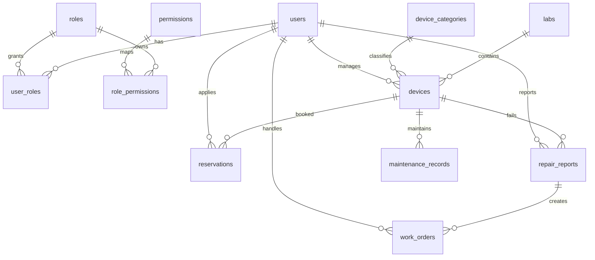

# 数据库设计

## 主要实体

| 实体 | 说明 |
| --- | --- |
| users | 用户 |
| roles | 角色 |
| permissions | 权限 |
| user_roles | 用户角色关联 |
| labs | 实验室 |
| device_categories | 设备分类 |
| devices | 设备 |
| reservations | 预约 |
| repair_reports | 报修记录 |
| work_orders | 维修工单 |
| maintenance_records | 维护记录 |
| operation_metrics | 运营指标快照 |

## 核心表草案

### users

| 字段 | 类型 | 说明 |
| --- | --- | --- |
| id | UUID | 主键 |
| username | VARCHAR(64) | 登录名 |
| password_hash | VARCHAR(255) | 密码哈希 |
| real_name | VARCHAR(64) | 真实姓名 |
| email | VARCHAR(128) | 邮箱 |
| phone | VARCHAR(32) | 手机号 |
| status | VARCHAR(32) | 用户状态 |
| created_at | TIMESTAMP | 创建时间 |
| updated_at | TIMESTAMP | 更新时间 |

### devices

| 字段 | 类型 | 说明 |
| --- | --- | --- |
| id | UUID | 主键 |
| code | VARCHAR(64) | 设备编号 |
| name | VARCHAR(128) | 设备名称 |
| category_id | UUID | 设备分类 ID |
| lab_id | UUID | 所属实验室 ID |
| manager_id | UUID | 负责人 ID |
| status | VARCHAR(32) | 设备状态 |
| health_score | NUMERIC(5,2) | 健康评分 |
| purchase_date | DATE | 购置日期 |
| created_at | TIMESTAMP | 创建时间 |
| updated_at | TIMESTAMP | 更新时间 |

### reservations

| 字段 | 类型 | 说明 |
| --- | --- | --- |
| id | UUID | 主键 |
| device_id | UUID | 设备 ID |
| applicant_id | UUID | 申请人 ID |
| approver_id | UUID | 审核人 ID |
| start_time | TIMESTAMP | 开始时间 |
| end_time | TIMESTAMP | 结束时间 |
| purpose | TEXT | 使用目的 |
| status | VARCHAR(32) | 预约状态 |
| reject_reason | TEXT | 拒绝原因 |
| created_at | TIMESTAMP | 创建时间 |
| updated_at | TIMESTAMP | 更新时间 |

### repair_reports

| 字段 | 类型 | 说明 |
| --- | --- | --- |
| id | UUID | 主键 |
| device_id | UUID | 设备 ID |
| reporter_id | UUID | 报修人 ID |
| fault_type | VARCHAR(64) | 故障类型 |
| description | TEXT | 故障描述 |
| status | VARCHAR(32) | 报修状态 |
| created_at | TIMESTAMP | 创建时间 |
| updated_at | TIMESTAMP | 更新时间 |

### work_orders

| 字段 | 类型 | 说明 |
| --- | --- | --- |
| id | UUID | 主键 |
| repair_report_id | UUID | 报修记录 ID |
| assignee_id | UUID | 处理人 ID |
| priority | VARCHAR(32) | 优先级 |
| status | VARCHAR(32) | 工单状态 |
| result | TEXT | 处理结果 |
| started_at | TIMESTAMP | 开始处理时间 |
| finished_at | TIMESTAMP | 完成时间 |
| created_at | TIMESTAMP | 创建时间 |
| updated_at | TIMESTAMP | 更新时间 |

## ER 关系概览

